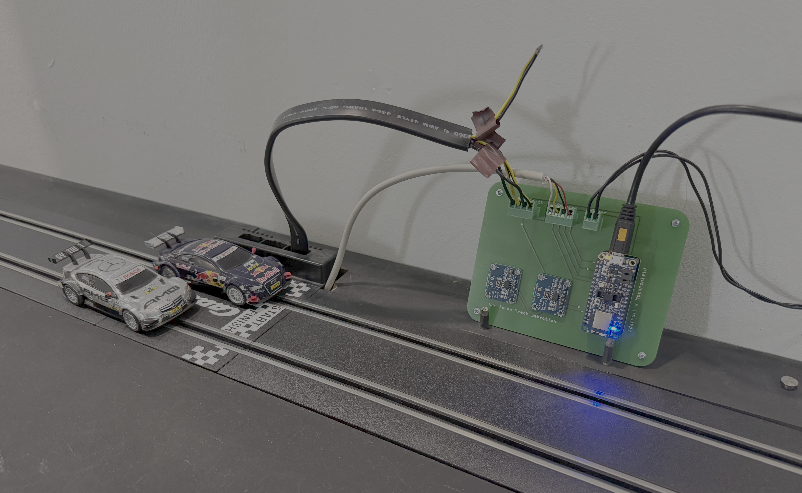
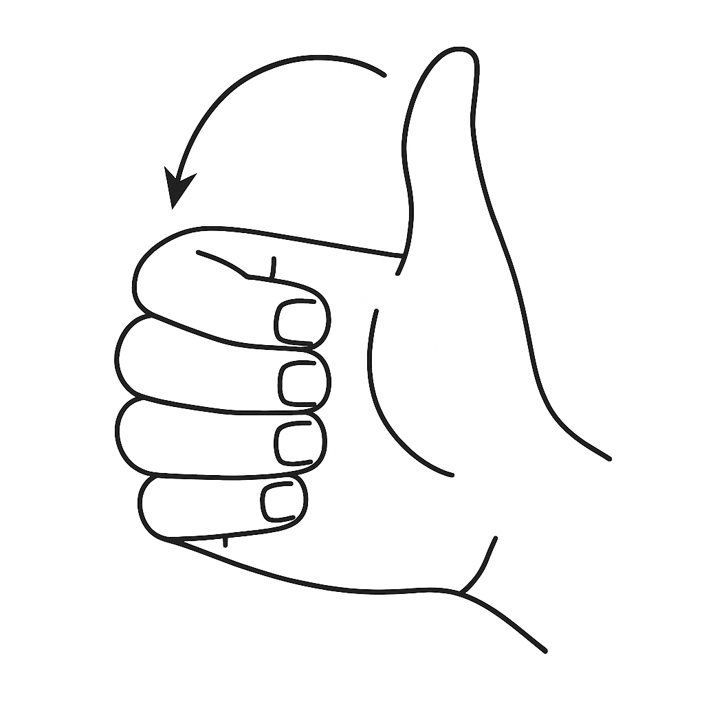
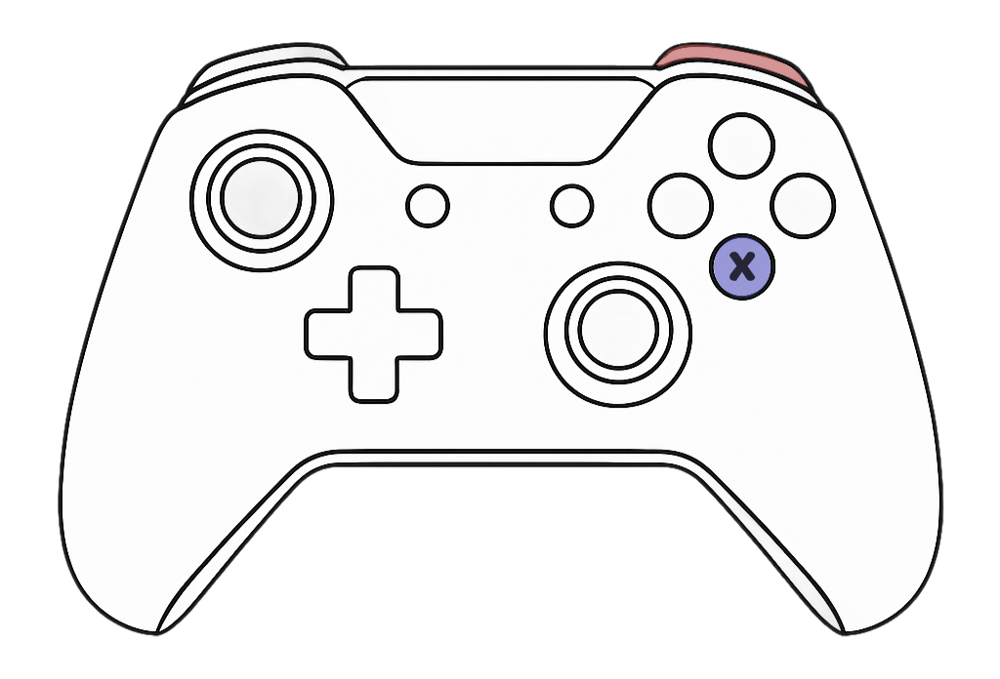
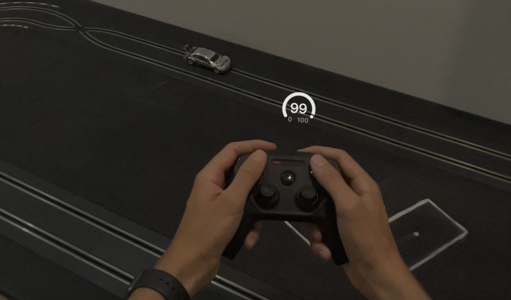
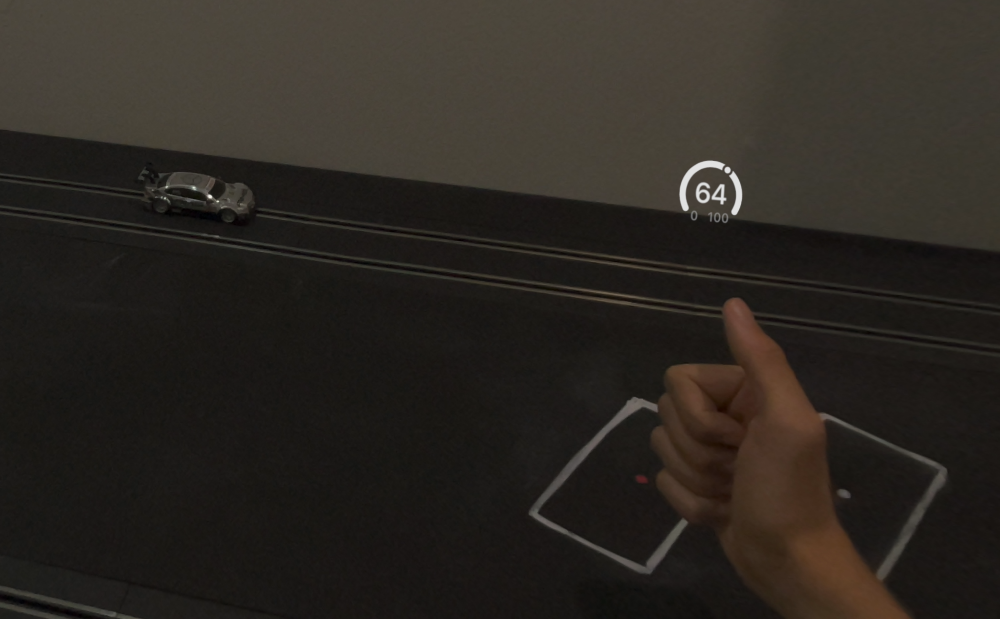
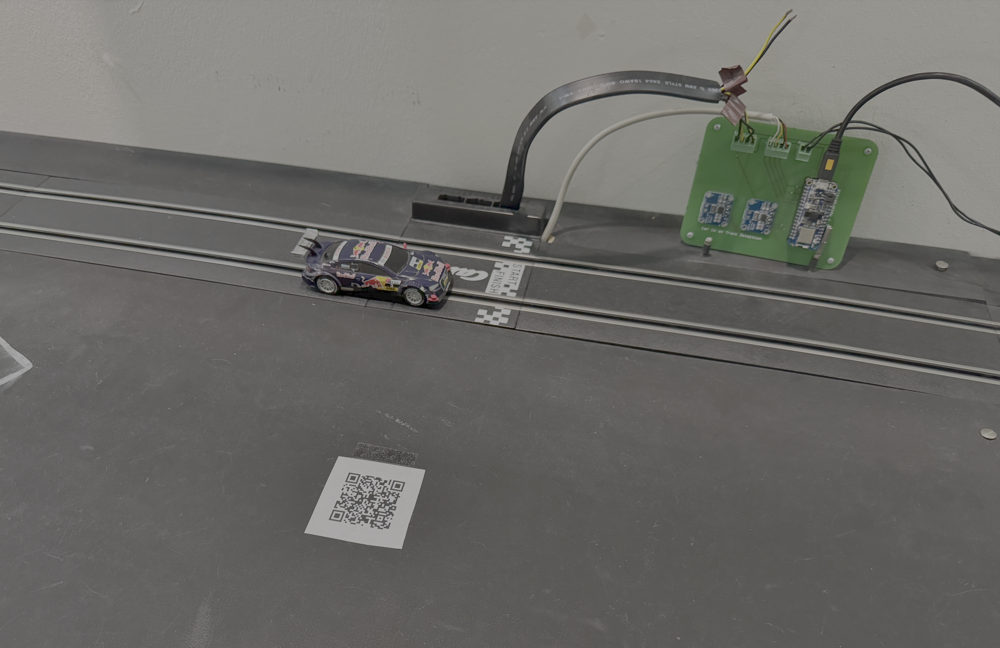
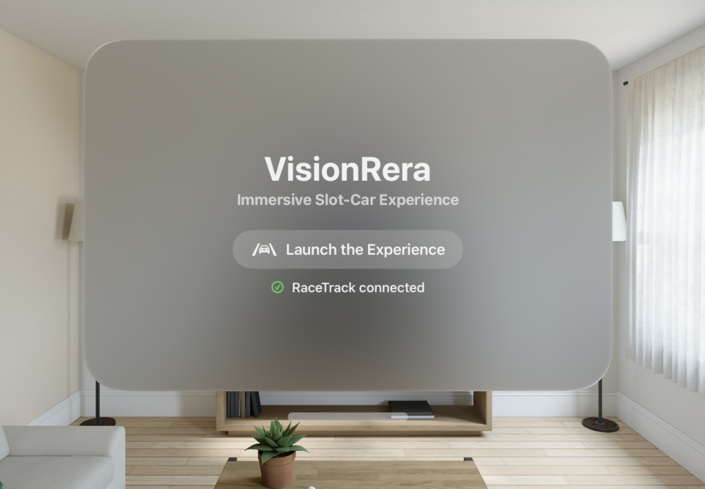
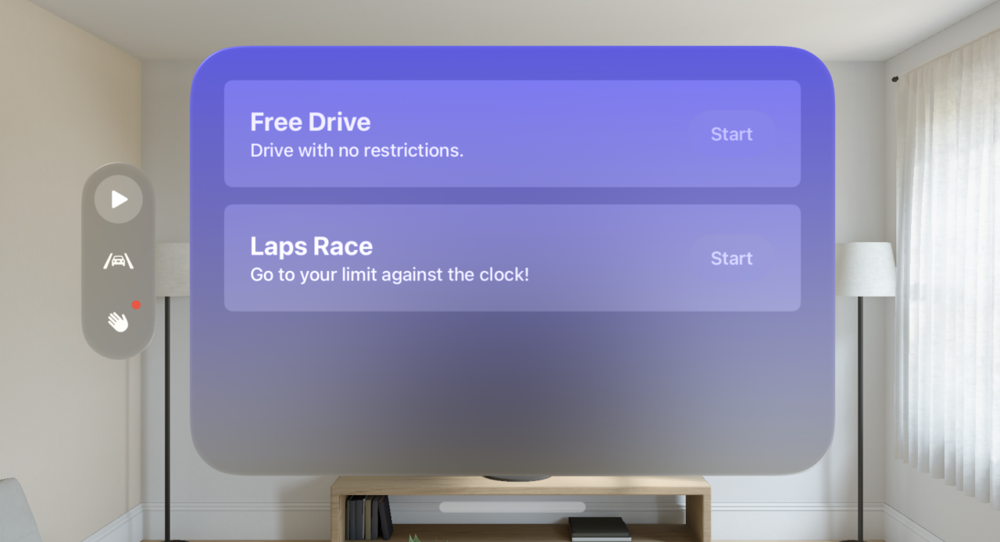
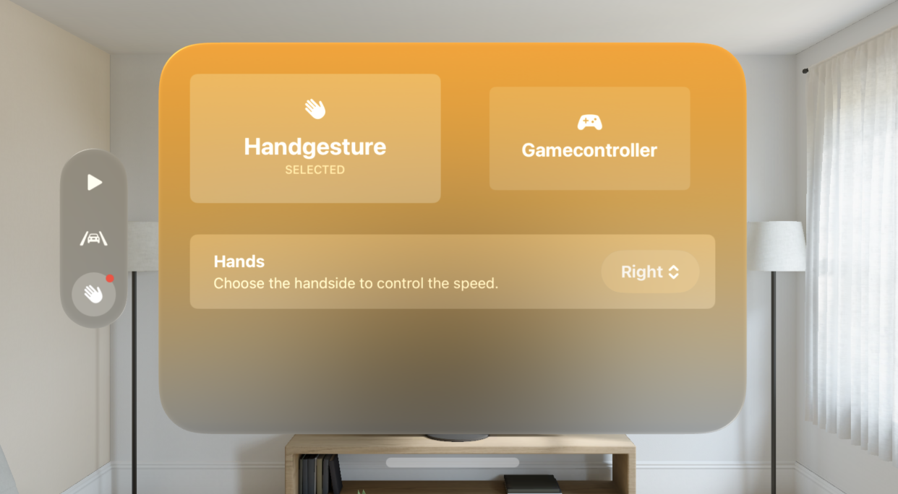

# VisionRera 🏎️

An AR-powered slot car racing app for Apple Vision Pro. Control a real Carrera Go track using hand gestures or a game controller — enhanced with augmented reality elements displayed in your environment.

> Built as a student project at DHBW Stuttgart to explore how AR can enhance interaction with physical toys.

## How It Works

A Carrera Go slot car track is connected to an Adafruit microcontroller, which handles speed control, lap timing, and car detection via sensors. The Apple Vision Pro connects to the microcontroller over **Bluetooth Low Energy (BLE)** and acts as both the controller and the display — overlaying AR elements like speed gauges, countdowns, and lap time notifications directly into the real world.

## Features

### 🎮 Input Methods

| Method | Description |
|---|---|
| **Hand Gesture (Fist)** | Make a fist and move your thumb to control speed — mimicking a classic slot car controller, no physical device needed. Uses the very accurate hand tracking of the Apple Vision Pro. |
| **Game Controller** | Use the right trigger for throttle. Press X to switch between speed curves. |

  
  

### 🏁 Game Modes

| Mode | Description |
|---|---|
| **Free Drive** | Drive freely and track individual lap times. |
| **Laps Race** | Complete a set number of laps as fast as possible. Crashes add a 2-second time penalty. |

### ✨ AR Elements

- **Speed Barometer** — A gauge attached to your hand showing the current speed in real time.
- **Race Countdown** — A 3D countdown (3… 2… 1… Go!) with particle effects and sound, anchored above the track.
- **Fastest Lap Notification** — A 3D text celebration with particles when you set a new best lap time.

  
  

### 📍 Track Position Scanning

A QR code placed on the start line lets the app detect the track's real-world position using ARKit's barcode detection. AR elements are then anchored relative to this position.

## Tech Stack

- **Platform:** visionOS (Apple Vision Pro)
- **Language:** Swift
- **Frameworks:** SwiftUI, ARKit, RealityKit, CoreBluetooth, Game Controller
- **Architecture:** MV pattern with modular Manager classes
- **Communication:** BLE (Bluetooth Low Energy) to Adafruit microcontroller
- **Hardware:** Carrera Go track, Adafruit microcontroller with motor shield, Hall sensors, INA219 current sensors

## Architecture Overview

The app is organized around five manager classes, each responsible for a core area:

| Manager | Responsibility |
|---|---|
| `RacetrackManager` | BLE connection and data exchange with the microcontroller |
| `ImmersiveManager` | AR session lifecycle, permissions, and hand tracking state |
| `InputManager` | Input method management (hand gestures, game controller) |
| `GameManager` | Game modes, features (lap timing, crash detection, countdown) |
| `TrackDetectionManager` | Track position scanning via QR code |

Game modes are built on a modular **feature system** — reusable building blocks like lap timing, crash detection, and countdown that can be mixed and matched to create new modes quickly.

## Requirements

- Apple Vision Pro with visionOS 2.0+
- Carrera Go track with custom microcontroller board
- Optional: Bluetooth game controller (e.g., PS5 DualSense, Xbox controller)

## Screenshots

| Launch Screen | Main Menu | Input Selection |
|---|---|---|
|  |  |  |

## License

This project was developed as part of a student thesis at [DHBW Stuttgart](https://www.dhbw-stuttgart.de/).
